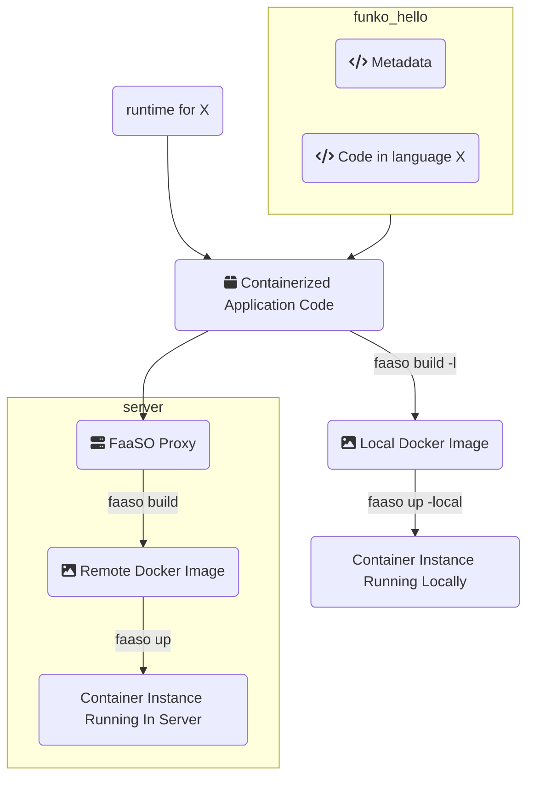
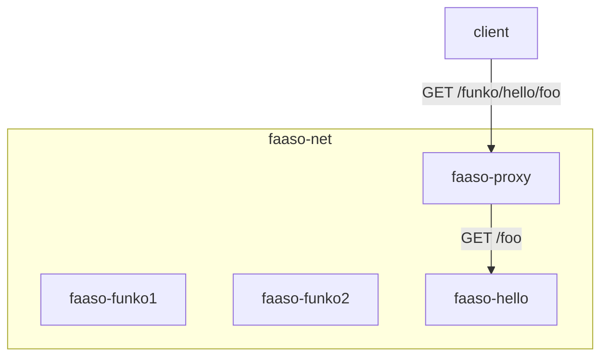

# Funkos What, Why, How

A funko is the equivalent of a AWS lambda. It's the unit
of deployment for FaaSO.

A funko is a folder containing a metadata `funko.yml` file
and source code in any language supported by a *runtime*

Think of a runtime as a template that gets merged with yout
funko and produces a full containerized application.

FaaSO can use your funko and its runtime to create a Docker image.

That docker image can be built in a server by the FaaSO proxy or it can be
built locally just like any docker image.

Then we can start it, either locally or in the server, using the proxy.

How is that application reached? FaaSO will usually run the image
in a *opinionated* way. All funkos listen in port 3000 in their own
container instances, and they are all segregated into a network called
faaso-net.

The faaso-proxy container will automatically proxy all requests so if you access the URL `http://faaso-proxy:8888/funko/hello/foo` that will be
proxied to `/foo` in the `hello` funko.

This is all done via naming conventions. You can create your own `faaso-whatever` container, add it to the `faaso-net` and faaso will
happily consider it a funko.

In the same way all funkos are simply docker containers running in that
network, with names following that convention. There is zero magic
involved.

The dynamic proxying is achieved by reading the current state of
Docker and just adapt to it using the naming conventions mentioned
above.